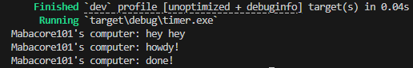

# Experiment README
## 1.2 Understanding how it works

- Based on the output, it can be seen that the `hey hey` print result appears first. This is because `hey hey` is located outside the async function. The program continues execution while still waiting for the result from the async process (future). Therefore, `hey hey` appears first.
