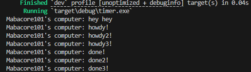
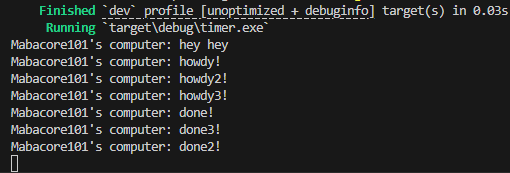

# Experiment README
## 1.2 Understanding how it works

- Based on the output, it can be seen that the `hey hey` print result appears first. This is because `hey hey` is located outside the async function. The program continues execution while still waiting for the result from the async process (future). Therefore, `hey hey` appears first.

## 1.3: Multiple Spawn and removing drop
### Drop on

### Drop off

- We can see that when we do not call `drop(spawner)`, the program will not stop. When a spawner calls the spawn function, a new task is created and sent to the task sender. The executor will take a task from the task sender, execute it, and continue taking tasks until there are none left and the spawner is dropped, which indicates that the interaction has ended. `drop(spawner)` is an indication that the interaction is complete and the spawner will be removed.
